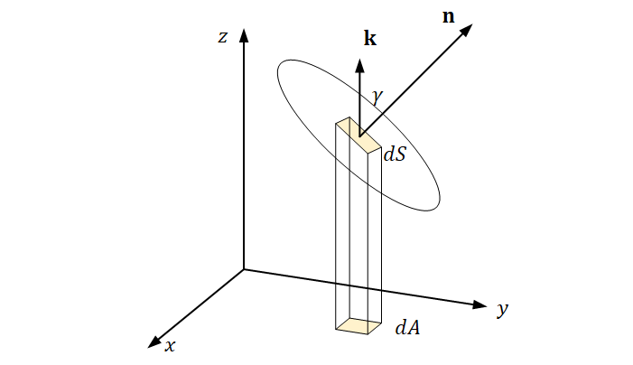

Welcome to drC1Ron's documentation!
===================================

**drC1Ron** is a Python library for GAI offers a *simple* and *intuitive* API.   

It pulls data from the database <https://world.openfoodfacts.org/>.   

Since Pythagoras, we know that :math:`a^2 + b^2 = c^2`.

.. math::
   e^{ix} = \cos(x) + i \sin(x)

   \int_a^bf(x)dx = I

Check out the :doc:`usage` section for further information, including
how to :ref:`installation` the project.

.. note::

   This project is under active development.

Contents
--------

.. toctree::

   usage
   api
